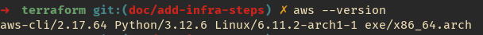
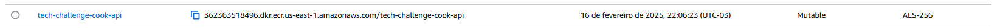
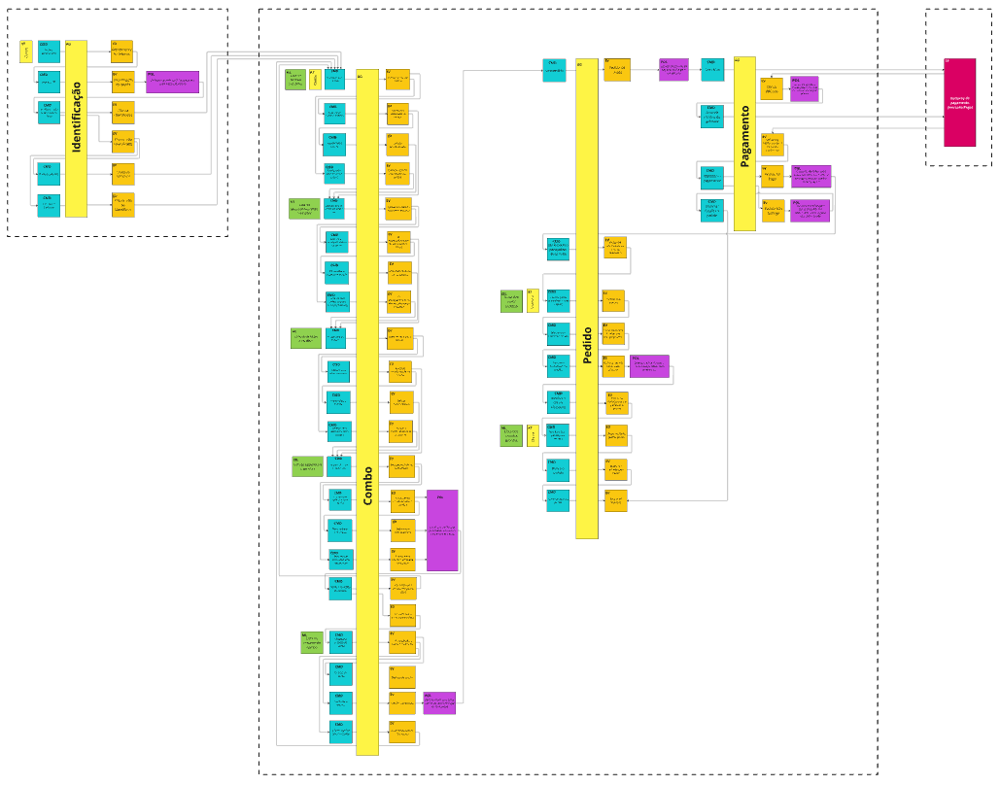

<div align="center">
  
# Tech Challenge - Cook API


<br>

</div>

## 💻 Descrição

O **Tech Challenge - Cook API** é um microserviço desenvolvido em **Node.js** com **NestJS** e **TypeScript**, seguindo os princípios da **Clean Architecture**. Ele é responsável por gerenciar os endpoints de **manutenção de produtos** do restaurante e **consulta de pedidos** para a cozinha.

## 🛠 Tecnologias Utilizadas


## 💫 Arquitetura

O projeto adota a **Clean Architecture**, garantindo flexibilidade, testabilidade e manutenção escalável.

## ⚙️ Configuração

### Pré-requisitos

1. É necessário executar a pipeline para criar o VPC no repositório: https://github.com/fiap-soat-12/tech-challenge-vpc
2. É necessário executar a pipeline para criar o SQS no repositório: https://github.com/fiap-soat-12/tech-challenge-queue

### Desenvolvimento

- **[Node.js 18+](https://nodejs.org/)**: Site oficial do NodeJs.
- **[NestJS CLI](https://docs.nestjs.com/cli/overview)**: Documentação oficial do NestJs.
- **[Docker](https://www.docker.com/)**: Site oficial do Docker.
- **[Docker Compose](https://docs.docker.com/compose/)**: Documentação oficial do Docker Compose.
- **[PostgreSQL](https://www.postgresql.org/)**: Documentação oficial do PostgreSQL.
- **[Sonarqube](https://www.sonarsource.com/products/sonarqube/)**: Site oficial do Sonarqube.
- **[Kubernetes](https://kubernetes.io/pt-br/docs/home/)**: Documentação oficial do Kubernetes.
- **[Terraform](https://www.terraform.io/)**: Site oficial do Terraform.
- **[AWS](https://aws.amazon.com/pt/)**: Site oficial da AWS.

### 🚀 Execução

### Subindo a aplicação com Docker Compose

1. Criar um arquivo `.env` na raiz do projeto com as seguintes variáveis:

```sh
DB_TYPE=postgresql
DB_USER=postgres
DB_HOST=localhost
DB_NAME=tc-cook-db
DB_PASSWORD=password
DB_PORT=5432
TZ=America/Sao_Paulo
AWS_REGION=us-east-1
ORDER_PRODUCT_CREATE_QUEUE=order-product-create-queue
ORDER_PRODUCT_CREATE_ACCEPT_QUEUE=order-product-create-accept-queue
ORDER_PRODUCT_DELETE_QUEUE=order-product-delete-queue
ORDER_PRODUCT_DELETE_ACCEPT_QUEUE=order-product-delete-accept-queue
ORDER_PRODUCT_UPDATE_QUEUE=order-product-update-queue
ORDER_PRODUCT_UPDATE_ACCEPT_QUEUE=order-product-update-accept-queue
COOK_ORDER_CREATE_QUEUE=cook-order-create-queue
ORDER_STATUS_UPDATE_QUEUE=order-status-update-queue
AWS_ACCESS_KEY_ID=teste
AWS_SECRET_ACCESS_KEY=teste
AWS_REGION=us-east-1
AWS_ENDPOINT=http://localhost:4566
AWS_URL=http://sqs.us-east-1.localhost.localstack.cloud:4566/000000000000
```

2. Executar o comando:

```sh
docker compose up
```

3. O serviço estará disponível em `http://localhost:3000/cook`

### Subindo a Cook API
  Caso deseje subir a Cook API, basta seguir os seguintes passos:
  
  1. Certificar que o Terraform esteja instalado executando o comando `terraform --version`;
  

  2. Certificar que o `aws cli` está instalado e configurado com as credenciais da sua conta AWS;
  

  3. Acessar a pasta `terraform` que contém os arquivos que irão criar a Cook API;
  4. Inicializar o Terraform no projeto `terraform init`;
  5. Verificar que o script do Terraform é valido rodando o comando `terraform validate`;
  6. Executar o comando `terraform plan` para executar o planejamento da execução/implementação;
  7. Executar o comando `terraform apply` para criar a Cook API;
  8. Após a execução do Terraform finalizar, verificar se a Cook API subiu corretamente na AWS;
  

## 📄 Documentação da API

A documentação da API pode ser acessada através do Swagger:

```bash
http://localhost:3000/cook/swagger
```

## 🔃 Fluxo de Execução das APIs

1. Criar um novo **produto** no restaurante via (POST) `/cook/v1/products`
2. Listar todos os produtos via (GET) `/cook/v1/products`
3. Atualizar um produto via (PUT) `/cook/v1/products/{id}`
4. Excluir um produto via (DELETE) `/cook/v1/products/{id}`
5. Consultar os **pedidos** em andamento na cozinha via (GET) `/cook/v1/orders`

## 🎲 Seeds

Este projeto utiliza **seeds** para pré-popular o banco de dados. O **Flyway** gerencia essas migrações automaticamente ao iniciar a aplicação.

## 📚 Event Storming



Acesso ao MIRO com o Event Storming:
[Event Storming](https://miro.com/app/board/uXjVK1ekBDM=/)
